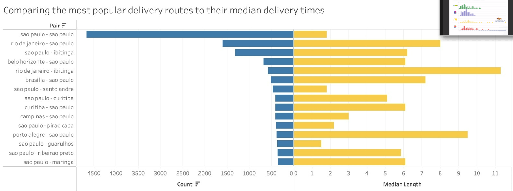

```{r setup, include=FALSE}
knitr::opts_chunk$set(echo = TRUE)
```

```{r libraries, include=FALSE}
library(tidyverse) #to read csv files
library(lubridate) # to handle dates
library(GGally) # for correlation-scatter plot matrix
library(ggfortify) # to produce residual diagnostic plots
library(rsample) # to split dataframe in training- & testing sets
library(janitor) # clean_names()
library(broom) # use broom:augment() to get tidy table with regression output, residuals, etc
library(huxtable) # to get summary table of all models produced
library(caret) # to train more advanced models (k-fold cross-validation, stepwise regression, LASSO)
library(nnet) # to calculate the maximum value of a vector
library(zoo) #to allow for time series operations
library(hms)
library(skimr)
library(leaflet)
library(tmap)
library(tmaptools)
library(hrbrthemes)
library(mapview)
library(viridis)
library(vroom)
library(sf)
library(geobr)
library(geosphere)

```


## Load the data
The whole dataset can be found on https://www.kaggle.com/olistbr/brazilian-ecommerce

```{r, load_data, warning=FALSE, message=FALSE}
customer <- read_csv("olist_customers_dataset.csv")
geolocation <- read_csv("olist_geolocation_dataset.csv")
order_item <- read_csv("olist_order_items_dataset.csv")
order_payment <- read_csv("olist_order_payments_dataset.csv")
order_review <- read_csv("olist_order_reviews_dataset.csv")
order <- read_csv("olist_orders_dataset.csv")
product <- read_csv("olist_products_dataset.csv")
seller <- read_csv("olist_sellers_dataset.csv")
product_category <- read_csv("product_category_name_translation.csv")
```
```{r, warning=FALSE, message=FALSE}
#Join the dataframes
ols_raw <- order %>% 
  left_join(customer, by = "customer_id") %>% 
  left_join(order_item, by = "order_id") %>% 
  left_join(order_payment, by = "order_id") %>% 
  left_join(order_review, by = "order_id") %>% 
  left_join(product, by = "product_id") %>% 
  left_join(seller, by = "seller_id") %>% 
  left_join(product_category, by = "product_category_name") %>% 
  clean_names()

```

```{r, warning=FALSE, message=FALSE}
ols_clean <- ols_raw %>% 
  #Comment message in Portuguese
  select(-review_comment_message)
```

# geolocation analysis

As mentioned previously, the main aim of this project is to see if we can develop insights from the OList dataset that could inform potential strategic insights. With a logistical online marketplace that serves the entirety of Brazil, the best place to start is to analyse the data on a geographical level. 

We therefore begin by focusing on the key regional/geographical factors, initially trying to find out where most of our sellers and buyers are located to see if this can give us any key insights. 

We start by grouping the customers and sellers by state to find out where the majority of the OList users are located. Predominantly we are trying to find out: 

1.	Are there any significant differences between the locations of buyers and sellers? 
2.	Are there any specific geographical locations in which we should target future strategies? 

The code that produces these plots is as follows:
```{r, warning=FALSE, message=FALSE}

products <- read.csv(file = 'olist_products_dataset.csv')
head(products)

sellers <- read.csv(file = 'olist_sellers_dataset.csv')
head(products)

orders <- read.csv(file = 'olist_orders_dataset.csv')
head(products)

geolocation <- read.csv(file = 'olist_geolocation_dataset.csv')
head(products)

customers <- read.csv(file = 'olist_customers_dataset.csv')
head(products)
```


```{r, warning=FALSE, message=FALSE}
unique(customers$customer_state)
```

```{r, warning=FALSE, message=FALSE}
customers <- customers %>% 
  mutate(state_name = case_when(customer_state == "SP" ~ "São Paulo", 
                               customer_state == "SC" ~ "Santa Catarina",
                               customer_state == "MG" ~ "Minas Gerais", 
                               customer_state == "PR" ~ "Parana",
                               customer_state == "RJ" ~ "Rio de Janeiro",
                               customer_state == "RS" ~ "Rio Grande do Sul",
                               customer_state == "PA" ~ "Para",
                               customer_state == "GO" ~ "Goias",
                               customer_state == "ES" ~ "Espirito Santo",
                               customer_state == "BA" ~ "Bahia",
                               customer_state == "MA" ~ "Maranhao",
                               customer_state == "MS" ~ "Mato Grosso do Sul",
                               customer_state == "CE" ~ "Ceara",
                               customer_state == "DF" ~ "Distrito Federal",
                               customer_state == "RN" ~ "Rio Grande do Norte",
                               customer_state == "PE" ~ "Pernambuco",
                               customer_state == "MT" ~ "Mato Grosso",
                               customer_state == "AM" ~ "Amazonas",
                               customer_state == "AP" ~ "Amapa",
                               customer_state == "AL" ~ "Alagoas",
                               customer_state == "RO" ~ "Rondonia",
                               customer_state == "PB" ~ "Paraiba",
                               customer_state == "TO" ~ "Tocantins",
                               customer_state == "PI" ~ "Piaui",
                               customer_state == "AC" ~ "Acre",
                               customer_state == "SE" ~ "Sergipe",
                               customer_state == "RR" ~ "Roraima",)
)
```


```{r, warning=FALSE, message=FALSE}
sellers <- sellers %>% 
  mutate(state_name = case_when(seller_state == "SP" ~ "São Paulo", 
                               seller_state == "SC" ~ "Santa Catarina",
                               seller_state == "MG" ~ "Minas Gerais", 
                               seller_state == "PR" ~ "Parana",
                               seller_state == "RJ" ~ "Rio de Janeiro",
                               seller_state == "RS" ~ "Rio Grande do Sul",
                               seller_state == "PA" ~ "Para",
                               seller_state == "GO" ~ "Goias",
                               seller_state == "ES" ~ "Espirito Santo",
                               seller_state == "BA" ~ "Bahia",
                               seller_state == "MA" ~ "Maranhao",
                               seller_state == "MS" ~ "Mato Grosso do Sul",
                               seller_state == "CE" ~ "Ceara",
                               seller_state == "DF" ~ "Distrito Federal",
                               seller_state == "RN" ~ "Rio Grande do Norte",
                               seller_state == "PE" ~ "Pernambuco",
                               seller_state == "MT" ~ "Mato Grosso",
                               seller_state == "AM" ~ "Amazonas",
                               seller_state == "AP" ~ "Amapa",
                               seller_state == "AL" ~ "Alagoas",
                               seller_state == "RO" ~ "Rondonia",
                               seller_state == "PB" ~ "Paraiba",
                               seller_state == "TO" ~ "Tocantins",
                               seller_state == "PI" ~ "Piaui",
                               seller_state == "AC" ~ "Acre",
                               seller_state == "SE" ~ "Sergipe",
                               seller_state == "RR" ~ "Roraima",)
)
```

```{r, warning=FALSE, message=FALSE}
customer_locations <- customers %>%
  count(customer_state) %>% 
  mutate(proportion = n/sum(n) * 100)

seller_locations <- sellers %>%
  count(seller_state) %>%
  mutate(proportion = n/sum(n) * 100)

customer_locations2 <- customers %>%
  count(customer_state) 

seller_locations2 <- sellers %>%
  count(seller_state)
```


```{r, warning=FALSE, message=FALSE}
  datasets <- list_geobr()
print(datasets, n=21)

#state <- read_state(code_state="SE", year=2018)
meso <- read_intermediate_region(year=2020)
states <- read_state(year=2020)
```


```{r, warning=FALSE, message=FALSE}
# Importing city data for Brazil

cities <- read.csv(file = 'br.csv', encoding = "UTF-8")
head(cities)

cities <- cities %>%
  filter(population > 2500000)

```


```{r, warning=FALSE, message=FALSE}
# Remove plot axis
  no_axis <- theme(axis.title=element_blank(),
                   axis.text=element_blank(),
                   axis.ticks=element_blank(),
                   panel.grid.major = element_blank(),
                   panel.grid.minor = element_blank())


# Plot all Brazilian states
  ggplot() +
    geom_sf(data=states, fill="#2D3E50", color="#FEBF57", size=.15, show.legend = FALSE) +
    labs(subtitle="States", size=8) +
    theme_minimal() +
    no_axis+
    geom_point(data = cities, aes(x = lng, y = lat), size = 2.2, colour = "red")+
    NULL
```


```{r, warning=FALSE, message=FALSE}
states2 <- dplyr::left_join(states, customer_locations, by = c("abbrev_state" = "customer_state"))
```


```{r, warning=FALSE, message=FALSE}

# colour scale I used in the map
brazil_color_scale <- c('#ffffff', '#002776')

library(ggrepel)

ggplot() +
    geom_sf(data=states2, aes(fill=proportion), color= "black", size=.12) +
      labs(title=bquote("Distribution of" ~bold("OList Customers")~ "by Brazilian State: 2016 - 2018"), size=15, subtitle = "Including the locations of Brazil's 5 largest cities") +
      #scale_fill_distiller(palette = "Spectral", name = "Proportion of Total Customers (%)", limits = c(0,50))+
    scale_fill_gradientn(colours = brazil_color_scale, name = "Proportion of Customer base (%)")+
      theme_minimal()+
      geom_point(data = cities, aes(x = lng, y = lat), size = 2.2, colour = "#ffdf00")+
      geom_label_repel(data = cities, aes(x = lng, y = lat, label=city), box.padding = 0.5, size = 3, nudge_x = 0.1, max.overlaps = Inf, fill = "#ffdf00", color = "black") +
      no_axis
```


```{r, warning=FALSE, message=FALSE}
states3 <- dplyr::left_join(states, seller_locations, by = c("abbrev_state" = "seller_state"))
states3[is.na(states3)] <- 0
```


```{r, warning=FALSE, message=FALSE}

brazil_color_scale2 <- c('#ffffff', '#009c3b')

ggplot() +
    geom_sf(data=states3, aes(fill=proportion), color= "black", size=.12) +
      labs(title=bquote("Distribution of" ~bold("OList Sellers")~ "by Brazilian State: 2016 - 2018"), size=15, subtitle = "Including the locations of Brazil's 5 largest cities")+
      scale_fill_gradientn(colours = brazil_color_scale2, name = "Proportion of Customer base (%)")+

      geom_point(data = cities, aes(x = lng, y = lat), size = 2.2, colour = "gray11")+
      geom_label_repel(data = cities, aes(x = lng, y = lat, label=city), box.padding = 0.5, size = 3, nudge_x = 0.1, max.overlaps = Inf, fill = "#ffdf00", color = "black") +
      theme_minimal() +
      no_axis
```

As we can see, the visualisations produced highlight that there is not a significant difference in the regional locations of our buyers and our sellers. We may have assumed that sellers might be in more dispersed, decentralized locations than buyers – however, this is not the case. Ultimately it seems that OList buyers and sellers are in largely the same parts of the country. 

Additionally, we can see that both buyers and sellers are typically focused around the more urban areas of south-eastern Brazil. There are very few buyers and sellers in the other parts of Brazil – and this is probably due to geographic reasons – as rural and rainforest areas make up large components of the rest of the country. These visualisations and further study of our data highlights that OList users are very biased towards urban environments – therefore, in the rest of our analysis we will primarily focus on users in major Brazilian cities.

# courier analysis
```{r, warning=FALSE, message=FALSE}
cities <- read.csv(file = 'br_latlon.csv') 

major_cities <- c("sao paulo","rio de janeiro","brasilia","belo horizonte","curitiba","ibitinga","santo andre")

seller_coor <- seller %>% 
  left_join(cities, by = c("seller_city" = "city")) %>% 
  select(seller_id,seller_city,lat,lng) %>% 
  rename(seller_lat = lat, seller_lng = lng)
  
order_seller <- left_join(order_item, seller_coor, by = "seller_id")

order_seller_delivery <- left_join(order_seller, order, by = "order_id")

customer_coor <- customer %>% 
  left_join(cities, by = c("customer_city" = "city")) %>% 
  select(customer_id,customer_city,lat,lng) %>% 
  rename(customer_lat = lat, customer_lng = lng)

customer_seller_delivery <- left_join(order_seller_delivery, customer_coor, by = "customer_id")

courier_data <- customer_seller_delivery %>% 
  select(customer_city,seller_city,order_delivered_carrier_date,order_delivered_customer_date,
         customer_lat,customer_lng,seller_lat,seller_lng) %>% 
  drop_na() %>% 
  mutate(delivery_length = round(difftime(order_delivered_customer_date,order_delivered_carrier_date,units = "days"),1)) %>% 
  mutate(delivery_length = as.numeric(str_remove(delivery_length,"days"))) %>% 
  mutate(distance = rep(0,13297)) %>% 
  filter(delivery_length > 0)


for (ii in (1:nrow(courier_data)))
    {
  courier_data$distance[ii] = 0.001*distm(c(courier_data$customer_lng[ii],courier_data$customer_lat[ii]),
                                    c(courier_data$seller_lng[ii],courier_data$seller_lat[ii]),fun = distHaversine)
}

```

```{r, warning=FALSE, message=FALSE}

courier_plot <- courier_data %>% 
  filter(delivery_length < 50) %>% 
  group_by(customer_city,seller_city) %>% 
  summarise(count = n(), median_length = median(delivery_length),
            average_length = mean(delivery_length),
            distance = mean(distance)) %>% 
  arrange(desc(count)) %>% 
  mutate(path = paste(seller_city,"to",customer_city)) %>% 
  # Only replaced the first "sao paulo" found for each row, so we repeat this step
  mutate(path = str_replace(path, "sao paulo","Sao Paulo")) %>% 
  mutate(path = str_replace(path, "sao paulo","Sao Paulo")) %>% 
  mutate(path = str_replace(path, "rio de janeiro","Rio de Janeiro")) %>% 
  mutate(path = str_replace(path, "ibitinga","Ibitinga")) %>% 
  mutate(path = str_replace(path, "brasilia","Brasilia")) %>% 
  mutate(path = str_replace(path, "santo andre","Santo Andre")) 
```

```{r,fig.height=4,fig.width=10, warning=FALSE, message=FALSE}

major_paths <- c("Sao Paulo to Rio de Janeiro",
                 "Ibitinga to Sao Paulo","Ibitinga to Rio de Janeiro",
                 "Sao Paulo to Brasilia")
courier_plot %>% 
  ggplot(aes(x = distance, y = average_length)) + 
  geom_point(alpha = 0.4,color="#009c3b",
             aes(size = count)) +
  geom_point(alpha = 0.8,color="#002776",data = subset(courier_plot, path %in% major_paths),
             aes(size = count)) +
  geom_point(alpha = 0.8,color="#002776",data = subset(courier_plot, path %in% c("Santo Andre to Sao Paulo",
                                                                               "Sao Paulo to Sao Paulo")),
             aes(size = count)) +
  geom_smooth(method=lm,  linetype="dashed",
             color="darkred", fill="#ffdf00", alpha = 0.2) +
  geom_text_repel(data = subset(courier_plot, path %in% major_paths),
            aes(label = path), hjust = 1, vjust = 0.2) +
  geom_text_repel(data = subset(courier_plot, path == "Santo Andre to Sao Paulo"),
            aes(label = path), hjust = -0.5, vjust = 0.2) +
  geom_text_repel(data = subset(courier_plot, path == "Sao Paulo to Sao Paulo"),
            aes(label = path), nudge_y = -0.6) +
  labs(title = "Shipping time is positively proportional to the distance",
       subtitle = "Scatter plot of average shipping time for each route versus the corresponding distance and their best fit line",
       x = "Distance (km)", y = "Average shipping time (days)") +
  scale_size(name = "Total number of items") +
  theme_minimal() +
  theme(plot.title = element_text(face = "bold", size = 15),
        plot.subtitle = element_text(size = 13)) 
  
```

What determines the shipping time? After plotting the average shipping time and the distance for the most popular shipping routes, we can see that they are postively correlated. The further away the customer is located from the seller, the longer it takes. However, the majority of routes still take more than 5 days to reach their destinations. Overall, the courier efficiency is low and only cities within 100 km can realised next-day delivery.

Nevertheless, distance seems to have much more explanatory power than the number of purchases made on the route.

```{r, warning=FALSE, message=FALSE}
res <- cor.test(courier_plot$average_length, courier_plot$distance, 
                    method = "pearson")
res
```



In the above graph we can see a clear relationship between the median delivery time and the frequency of the delivery route. Obviously deliveries within Sao Paolo have the shortest delivery time, and therefore also have the highest count, as can be expected by the countries largest economic hub. The longer the delivery time the smaller the amount of orders for those delivery routes. This can also be explained by the fact that the further a location is from the major economic hubs, the smaller the population of those cities tends to be. 
Therefore OList should focus on decreasing delivery times between those hubs that are geographically close, such as Rio de Janeiro to Sao Paolo. Our records indicate that decreasing delivery times here would significantly increase the amount of orders travelling this route.

# gdp and spending analysis

```{r distinct orders, warning=FALSE, message=FALSE}
#There are multiple entries for one order because when we joined order with order_payment, there could be multiple payment methods for one order, thus resulting in multiple rows for one order. Here we only keep one row for each order and sum up the total payment amount. 
order_total_amount <- ols_clean %>%
  group_by(order_id) %>%
  summarise(total_payment = sum(payment_value))
purchase_info <- ols_clean %>%
  select(order_id,
         customer_unique_id,
         review_score,
         product_category_name_english,
         customer_city) %>%
  distinct(order_id, .keep_all = TRUE)
purchase_info <- left_join(purchase_info,order_total_amount,by = "order_id")
```

```{r customer info, warning=FALSE, message=FALSE}
customer_purchase <- purchase_info %>% 
  count(customer_unique_id, product_category_name_english) %>% 
  group_by(customer_unique_id) %>% 
  mutate(total_purchase = sum(n),
         category_percent = round((n/total_purchase)*100,2)) %>% 
  select(-n, -total_purchase) %>% 
  pivot_wider(names_from = product_category_name_english,
              values_from = category_percent)
unique_customer <- customer %>% 
  distinct(customer_unique_id,.keep_all = TRUE) %>% 
  select(-customer_id)
unique_customer_purchase <- purchase_info %>% 
  group_by(customer_unique_id) %>% 
  summarise(total_amount = sum(total_payment))
unique_customer_review <- purchase_info %>% 
  group_by(customer_unique_id) %>% 
  summarise(average_review_score = mean(review_score))
customer_info <- customer_purchase %>% 
  left_join(unique_customer, by = "customer_unique_id") %>% 
  left_join(unique_customer_purchase, by = "customer_unique_id") %>% 
  left_join(unique_customer_review, by = "customer_unique_id") %>% 
  ungroup() %>% 
  select(-customer_zip_code_prefix,-customer_state)
customer_info[is.na(customer_info)] <- 0
```

```{r, warning=FALSE, message=FALSE}
to_graph <- customer_info %>% 
  select(customer_unique_id, customer_city, total_amount, average_review_score)
```

```{r, warning=FALSE, message=FALSE}
brazil_pop <- read_csv("Brazil_pop.csv")
brazil_pop$name <- tolower(brazil_pop$name)
names(brazil_pop)[names(brazil_pop) == '2021'] <- 'population'
```


```{r, warning=FALSE, message=FALSE}
to_graph2 <- to_graph %>% 
  group_by(customer_city) %>% 
  summarise(med_city_spend = median(total_amount), avg_city_spend = mean(total_amount) , obs = n(), tot_spend = sum(total_amount)) %>% 
  filter(obs > 1000)
```

```{r, warning=FALSE, message=FALSE}
to_graph3 <- left_join(to_graph2, brazil_pop, customer, by = c("customer_city" = "name"))
to_graph3 <- to_graph3 %>% 
  mutate(spend_pp = tot_spend/population)
```

```{r, warning=FALSE, message=FALSE}
cities <- c("salvador", "porto alegre", "rio de janeiro", "brasilia", "belo horizonte", "curitiba", "guarulhos", "campinas", "sao paulo")
gdp <- c(63526092, 77134613, 364052058, 254817205, 91957092, 87151950, 61325724, 61397263, 714683362)
cities_csv <- data.frame(cities, gdp)
```

```{r, warning=FALSE, message=FALSE}
to_graph4 <- left_join(to_graph3, cities_csv, by = c("customer_city" = "cities"))
to_graph4 <- to_graph4 %>% 
  mutate(gdp_pc = gdp/population/1000)
to_graph4$customer_city <- str_to_title(to_graph4$customer_city)

# prepare tableau graph 7
write.csv(to_graph4, "city_sales.csv")

```


Now that we have seen the regions where the most orders are being sent and delivered and the routes these take, it is time to investigate the spending that these customers engage in. Looking into the cities with high traffic, we want to examine two things. 

First of all if there is any pattern in spending related to the wealth of the people in a city, and if there are any inefficiencies that Olist could act on. Plotting this shows us a general trend where the spending per person on Olist products decreases as the GDP per capita in each city decreases. However there is one major outlier in this trend: the capital city Brasilia. 

From our understanding there are two main factors contributing to this. The first one is that the delivery times (as shown in the previous graph) for the Sao Paulo-Brasilia trip are relatively long; above average. While this in itself is not enough to drastically reduce people’s spending, it is certainly a contributing factor. For many goods its may be quicker and more convenient to go buy them in person rather than ordering them from Olist. Secondly, Brasilia is host to the Brazilian government and all related functions. Around 54.8% of the city’s GDP is driven by public administration services, meaning that little of this goes directly to citizens and is hardly distributed amongst the population. Therefore while the city may generate a lot of wealth, not as much is seen by its citizens and so they do not get to spend it on goods as much as people in other cities. Taking these factors into account, this data point makes more sense.

On the other hand, cities with high GDP with relatively low spending, for example Guarulhos, can be OList's next strategic marketing priority. With this said, we will look at which categories of goods have the most market attractiveness and which categories should we avoid. 

# product category analysis
```{r, warning=FALSE, message=FALSE}
#tableau worksheet1
write.csv(ols_clean, "ols_clean.csv")
```


We can see from the top 10 selling categories that "Health and Beauty", "Bed bath table" and "Watches gifts" are among them. All of the top 10 categories generate total sales of over R$500k. We can see that "Bed bath table" has the most quantities sold. Therefore, our recommendation is that when we consider to enter a new market that is not exploited by OList extensively, for example Guarulhos, we will prioritize the goods that can generate the most revenue, including the top 3 product categories. 

```{r, warning=FALSE, message=FALSE}
#tableau worksheet2

#substring year from timestamp column
ols_clean$year <- substr(ols_clean$order_purchase_timestamp, 1, 4) 

#calculate revenue and goods sold for each product categories
product_sales <- ols_clean %>% 
  mutate(sales = order_item_id*price) %>% 
  group_by(year, product_category_name_english) %>% 
  summarise(volume = n(),
            revenue = sum(sales),
            avg_price = mean(price),
            avg_rating = mean(review_score)) %>% 
  select(product_category_name_english, volume, revenue, avg_price, avg_rating) %>% 
  filter(!is.na(product_category_name_english))

#output the csv file for tableau worksheet2
write.csv(product_sales, "product_sales.csv")
```


We can see from the 2017 data that total revenue of OList amounts to R$7,265k within the dataset. Number of goods sold amounts to 53k. And there are in total 71 categories of products on the platform. 


With the above graph, we can see that the products with the lowest revew ratings are "Fashion male clothing" and "Home comfort". Therefore, these categories can be problematic when OList want to make a market entry into a certain city. To reduce the negative impact on OList's branding, these categories should be avoided in the initial stage. To figure out what is the root cause of the negative reviews and potentially solve the issue and making OList's service quality better, we will take a deeper look into them as follows. 


We can see that the lowest categories receive average ratings of 2.2/5.0. 

```{r, warning=FALSE, message=FALSE}
#tableau worksheet5

#get all comment messages for fashion_male_clothing
product_review <- ols_raw %>% 
  filter(product_category_name_english == "fashion_male_clothing") %>% 
  select(review_comment_title, review_comment_message)

#glimpse the bag of words
paste(product_review$review_comment_message, collapse=" ")

#transform bag of words into DTM
library(tm)
library(corpus)
review_fmc <- Corpus(VectorSource(product_review$review_comment_message))
inspect(review_fmc[1:5])

DTM_review_fmc <- DocumentTermMatrix(review_fmc, control = list(
            tolower = TRUE,
            removeNumbers = TRUE,
            stopwords = TRUE,
            removePunctuation = TRUE,
            stripWhitespace = TRUE)
)

M <- as.matrix(DTM_review_fmc)
DTM_tbl <- as_tibble(M)

DTM_tbl_tidy <- pivot_longer(DTM_tbl, cols = !que, names_to = "word", values_to = "wordCount")

wordCountDoc <- DTM_tbl_tidy %>%  
        group_by(word) %>% 
        summarise(total = sum(wordCount)) %>% 
        arrange(desc(total)) 

write.csv(wordCountDoc, "fmc.csv")

#translate the column of words from Portuguese to English
translate <- read_csv("translate_fmc.csv")

translate2 <- DTM_tbl_tidy %>% 
  left_join(translate, by = "word")

wordCountDoc2 <- translate2 %>%  
        group_by(en) %>% 
        summarise(total = sum(wordCount)) %>% 
        arrange(desc(total)) %>% 
        filter(en!="product") %>% 
        filter(en!="Good") %>% 
        filter(en!="I asked") %>% 
        filter(en!="bought")

#output the wordcloud
library(wordcloud2)
wordcloud2(data = wordCountDoc2, color = "random-light", backgroundColor = "white") 
```

We translated each of the Portuguese review messages to English. From the wordcloud, we can see that the biggest complaints from "Fashion male clothing" are delayed delivery, followed by product quality. 

```{r, warning=FALSE, message=FALSE}
#tableau worksheet6

#get all comment messages for home comfort
product_review <- ols_raw %>% 
  filter(product_category_name_english == "home_comfort_2") %>% 
  select(review_comment_title, review_comment_message)

#glimpse the bag of words
paste(product_review$review_comment_message, collapse=" ")

#transform bag of words into DTM
review_hc <- Corpus(VectorSource(product_review$review_comment_message))
inspect(review_hc[1:5])

DTM_review_hc <- DocumentTermMatrix(review_hc, control = list(
            tolower = TRUE,
            removeNumbers = TRUE,
            stopwords = TRUE,
            removePunctuation = TRUE,
            stripWhitespace = TRUE)
)

M <- as.matrix(DTM_review_hc)
DTM_tbl <- as_tibble(M)

DTM_tbl_tidy <- pivot_longer(DTM_tbl, cols = !que, names_to = "word", values_to = "wordCount")

wordCountDoc <- DTM_tbl_tidy %>%  
        group_by(word) %>% 
        summarise(total = sum(wordCount)) %>% 
        arrange(desc(total)) 
print(wordCountDoc)

write.csv(wordCountDoc, "hc.csv")

#translate the column of words from Portuguese to English
translate <- read_csv("translate_hc.csv")

translate2 <- DTM_tbl_tidy %>% 
  left_join(translate, by = "word")

wordCountDoc2 <- translate2 %>%  
        group_by(en) %>% 
        summarise(total = sum(wordCount)) %>% 
        arrange(desc(total)) %>% 
        filter(en!="product") %>% 
        filter(en!="Good") %>% 
        filter(en!="I asked") %>% 
        filter(en!="bought") %>% 
        filter(en!="mine")


#output the wordcloud
wordcloud2(data = wordCountDoc2, color = "random-light", backgroundColor = "white") 
```

From the wordcloud, we can see that the biggest complaints from "Homd comfort" are delayed delivery, followed by product quality. 

Therefore, to further improve OList's service offerings, it needs to improve delivery efficiency on these two categories, as well as conduct quality control for goods listed by male clothing sellers.

# voucher analysis
```{r, warning=FALSE, message=FALSE}
cred_inst <- order_payment %>% 
  group_by(order_id) %>% 
  mutate(total_payment = sum(payment_value),
         payment_perc = payment_value / total_payment) %>% 
  ungroup() %>% 
  filter(payment_installments >1 ) %>% 
  mutate(price_range = ifelse(total_payment <= 100, "<100", 
                               ifelse(total_payment <= 500, "100-500",
                                      ifelse(total_payment <= 1000 , "500-1000",
                                             ifelse(total_payment <= 5000, "1000-5000",
                                      ">5000"))))) %>% 
  group_by(price_range) %>% 
  summarise(count = n(),
            mean_ins = mean(payment_installments),
            median_ins = median(payment_installments),
            average_perc = mean(payment_perc)) 


cred_inst$price_range <- factor(cred_inst$price_range,levels = c("<100","100-500","500-1000","1000-5000",">5000"))
cred_inst


```

```{r, warning=FALSE, message=FALSE}
voucher <- order_payment %>% 
  group_by(order_id) %>% 
  mutate(total_payment = sum(payment_value),
         payment_perc = payment_value / total_payment) %>% 
  ungroup() %>% 
  filter(payment_type == "voucher" ) %>% 
  group_by(order_id) %>% 
  mutate(voucher_total_value = sum(payment_value),
         value_left = total_payment - voucher_total_value)

voucher_value_left <- voucher %>% 
  select(order_id,value_left) %>% 
  distinct()

cred_voucher <- order_payment %>% 
  left_join(voucher_value_left, by = "order_id") %>% 
  filter(!is.na(value_left) & value_left > 0 & payment_type == "credit_card") %>% 
  mutate(value_range = ifelse(value_left <= 50, "<50", 
                               ifelse(value_left <= 100, "50-100",
                                      ifelse(value_left <= 200 , "100-200",
                                             ifelse(value_left <= 500, "200-500",
                                                    ifelse(value_left <= 5000, "500-5000",
                                      ">5000")))))) %>% 
  group_by(value_range) %>% 
  summarise(count = n(),
            mean_ins = mean(payment_installments),
            median_ins = median(payment_installments)) %>% 
  mutate(voucher = rep("Yes",5))

cred_voucher$value_range <- factor(cred_voucher$value_range,levels = c("<50","50-100","100-200","200-500","500-5000",">5000"))
cred_voucher
```

```{r, warning=FALSE, message=FALSE}

cred_no_voucher <- order_payment %>% 
  group_by(order_id) %>% 
  mutate(total_payment = sum(payment_value),
         payment_perc = payment_value / total_payment) %>% 
  ungroup() %>% 
  left_join(voucher_value_left, by = "order_id") %>% 
  filter(is.na(value_left) & payment_type == "credit_card") %>% 
  mutate(value_range = ifelse(total_payment <= 50, "<50", 
                               ifelse(total_payment <= 100, "50-100",
                                      ifelse(total_payment <= 200 , "100-200",
                                             ifelse(total_payment <= 500, "200-500",
                                                    ifelse(total_payment <= 5000, "500-5000",
                                      ">5000")))))) %>% 
  group_by(value_range) %>% 
  summarise(count = n(),
            mean_ins = mean(payment_installments),
            median_ins = median(payment_installments)) %>% 
  mutate(voucher = rep("No",6))

cred_no_voucher$value_range <- factor(cred_no_voucher$value_range,levels = c("<50","50-100","100-200","200-500","500-5000",">5000"))
cred_no_voucher


```


```{r, warning=FALSE, message=FALSE}
voucher_ins <- rbind(cred_voucher,cred_no_voucher)
voucher_ins$voucher <- factor(voucher_ins$voucher, levels = c("Yes","No"))
```


```{r,fig.height=6, fig.width=10, warning=FALSE, message=FALSE}

label1 <- "At very high price, using \n credit cards do not necessarily \n link to affordability."
label2 <- "For the same value, customers \n pay with more installments if it's \n the remaining value after deducting voucher."

ggplot(data = voucher_ins, aes(x = value_range, y = median_ins,
                               colour = voucher, group = voucher))+
  geom_point(size=2) +
  geom_line(size=1.5) +
  labs(title = "Vouchers entice people to purchase even if they need more installments",
       subtitle = "Median number of installments used by customers paying with credit cards for the total price or the remaining value after using vouchers",
  x ="Value Range" , y = "Median Number of Installments",
       colour = "Voucher") +
  
  geom_curve(
    data = data.frame(x = 5.5, y = 3.2, xend = 6, yend = 4.3),
    mapping = aes(x = x, y = y, xend = xend, yend = yend),
    colour = "darkred",
    size = 0.5,
    curvature = 0.25,
    arrow = arrow(length = unit(2, "mm"), type = "closed"),
    inherit.aes = FALSE
  ) +
  
   geom_curve(
    data = data.frame(x = 2.7, y = 4, xend = 2, yend = 4.4),
    mapping = aes(x = x, y = y, xend = xend, yend = yend),
    colour = "darkred",
    size = 0.5,
    curvature = -0.25,
    arrow = arrow(length = unit(2, "mm"), type = "closed"),
    inherit.aes = FALSE
  ) +
  
  geom_text(
    data = data.frame(x = 5.5, y = 2.5, label = label1),
    aes(x = x, y = y, label = label),
    colour="navyblue",
    family="Lato",
    hjust = 0.5,
    lineheight = .8,
    inherit.aes = FALSE
  ) +
    scale_color_manual(values=c('#009c3b','#ffdf00'))+

  ggplot2::annotate("rect", xmin = 2.9, xmax = 3.1, ymin = 2.8, ymax = 4.2, alpha = 0.2) +
  ggplot2::annotate("text", x = 2, y = 5.5, label = label2, colour = "#002776") +
  theme_minimal() +
  theme(strip.text = element_text(color = "white",size = 20),
        strip.text.y = element_text(angle=0),
        plot.title = element_text(size = 15),
        plot.subtitle = element_text(size = 10),
        axis.title.x = element_text(hjust = 0.5, size = 10),
        axis.title.y = element_text(hjust = 0.5, size = 10))
```

Let's assume number of installments can represent how affordable the good is relatively to the customer. The higher number of installments, the more "expensive" the good appears. For the same number of installments, "voucher : left value" has a lower value range than "full price". This means that people who pay the left value of (100-200) see the good as expensive as people who buy at full price of 200-500. For the voucher users, their purchasing power is lower.

# conclusion
Following our objective, which is to make strategic recommendations for OList, we have summarized the following. 
1. The most buyers and sellers are from major cities in the Southeast Brazil, with less saturated geolocations that are possible for OList's next market entry, for example Guarulhos. 
2. For a successful market entry to take place, OList needs to promote attractive products such as "Health and Beauty", and omit the poor performing ones such as "fashion male clothing". 
3. The most pressing issue of the poor performing products is delayed delivery, and we found that major cities has serious delay, for example from Ibitinga to Rio de Janeiro. 
4. To better understand customer's buying behaviour, we found that vouchers entice customers to purchase even if they need more installments. 
