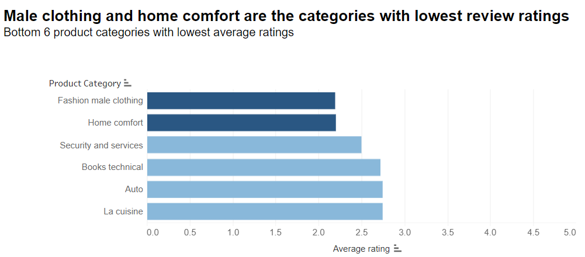
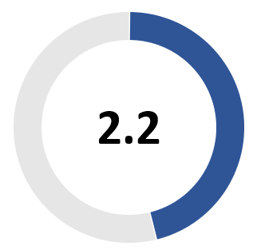

```{r setup, include=FALSE}
knitr::opts_chunk$set(echo = TRUE)
```

```{r, load libraries}
library(tidyverse) #to read csv files
library(lubridate) # to handle dates
library(GGally) # for correlation-scatter plot matrix
library(ggfortify) # to produce residual diagnostic plots
library(rsample) # to split dataframe in training- & testing sets
library(janitor) # clean_names()
library(broom) # use broom:augment() to get tidy table with regression output, residuals, etc
library(huxtable) # to get summary table of all models produced
library(caret) # to train more advanced models (k-fold cross-validation, stepwise regression, LASSO)
library(nnet) # to calculate the maximum value of a vector
library(zoo) #to allow for time series operations
library(hms)
library(skimr)
library(leaflet)
library(tmap)
library(tmaptools)
library(hrbrthemes)
library(mapview)
library(viridis)
library(vroom)
library(sf)
library(geobr)
```


## Load the data
The whole dataset can be found on https://www.kaggle.com/olistbr/brazilian-ecommerce

```{r, load data}
customer <- read_csv("olist_customers_dataset.csv")
geolocation <- read_csv("olist_geolocation_dataset.csv")
order_item <- read_csv("olist_order_items_dataset.csv")
order_payment <- read_csv("olist_order_payments_dataset.csv")
order_review <- read_csv("olist_order_reviews_dataset.csv")
order <- read_csv("olist_orders_dataset.csv")
product <- read_csv("olist_products_dataset.csv")
seller <- read_csv("olist_sellers_dataset.csv")
product_category <- read_csv("product_category_name_translation.csv")
```
```{r}
#Join the dataframes
ols_raw <- order %>% 
  left_join(customer, by = "customer_id") %>% 
  left_join(order_item, by = "order_id") %>% 
  left_join(order_payment, by = "order_id") %>% 
  left_join(order_review, by = "order_id") %>% 
  left_join(product, by = "product_id") %>% 
  left_join(seller, by = "seller_id") %>% 
  left_join(product_category, by = "product_category_name") %>% 
  clean_names()

```

```{r}
ols_clean <- ols_raw %>% 
  #Comment message in Portuguese
  select(-review_comment_message)
```

# geolocation analysis
```{r import data, message=FALSE}

products <- read.csv(file = 'olist_products_dataset.csv')
head(products)

sellers <- read.csv(file = 'olist_sellers_dataset.csv')
head(products)

orders <- read.csv(file = 'olist_orders_dataset.csv')
head(products)

geolocation <- read.csv(file = 'olist_geolocation_dataset.csv')
head(products)

customers <- read.csv(file = 'olist_customers_dataset.csv')
head(products)
```


```{r}
unique(customers$customer_state)
```

```{r}
customers <- customers %>% 
  mutate(state_name = case_when(customer_state == "SP" ~ "São Paulo", 
                               customer_state == "SC" ~ "Santa Catarina",
                               customer_state == "MG" ~ "Minas Gerais", 
                               customer_state == "PR" ~ "Parana",
                               customer_state == "RJ" ~ "Rio de Janeiro",
                               customer_state == "RS" ~ "Rio Grande do Sul",
                               customer_state == "PA" ~ "Para",
                               customer_state == "GO" ~ "Goias",
                               customer_state == "ES" ~ "Espirito Santo",
                               customer_state == "BA" ~ "Bahia",
                               customer_state == "MA" ~ "Maranhao",
                               customer_state == "MS" ~ "Mato Grosso do Sul",
                               customer_state == "CE" ~ "Ceara",
                               customer_state == "DF" ~ "Distrito Federal",
                               customer_state == "RN" ~ "Rio Grande do Norte",
                               customer_state == "PE" ~ "Pernambuco",
                               customer_state == "MT" ~ "Mato Grosso",
                               customer_state == "AM" ~ "Amazonas",
                               customer_state == "AP" ~ "Amapa",
                               customer_state == "AL" ~ "Alagoas",
                               customer_state == "RO" ~ "Rondonia",
                               customer_state == "PB" ~ "Paraiba",
                               customer_state == "TO" ~ "Tocantins",
                               customer_state == "PI" ~ "Piaui",
                               customer_state == "AC" ~ "Acre",
                               customer_state == "SE" ~ "Sergipe",
                               customer_state == "RR" ~ "Roraima",)
)
```


```{r}
sellers <- sellers %>% 
  mutate(state_name = case_when(seller_state == "SP" ~ "São Paulo", 
                               seller_state == "SC" ~ "Santa Catarina",
                               seller_state == "MG" ~ "Minas Gerais", 
                               seller_state == "PR" ~ "Parana",
                               seller_state == "RJ" ~ "Rio de Janeiro",
                               seller_state == "RS" ~ "Rio Grande do Sul",
                               seller_state == "PA" ~ "Para",
                               seller_state == "GO" ~ "Goias",
                               seller_state == "ES" ~ "Espirito Santo",
                               seller_state == "BA" ~ "Bahia",
                               seller_state == "MA" ~ "Maranhao",
                               seller_state == "MS" ~ "Mato Grosso do Sul",
                               seller_state == "CE" ~ "Ceara",
                               seller_state == "DF" ~ "Distrito Federal",
                               seller_state == "RN" ~ "Rio Grande do Norte",
                               seller_state == "PE" ~ "Pernambuco",
                               seller_state == "MT" ~ "Mato Grosso",
                               seller_state == "AM" ~ "Amazonas",
                               seller_state == "AP" ~ "Amapa",
                               seller_state == "AL" ~ "Alagoas",
                               seller_state == "RO" ~ "Rondonia",
                               seller_state == "PB" ~ "Paraiba",
                               seller_state == "TO" ~ "Tocantins",
                               seller_state == "PI" ~ "Piaui",
                               seller_state == "AC" ~ "Acre",
                               seller_state == "SE" ~ "Sergipe",
                               seller_state == "RR" ~ "Roraima",)
)
```

```{r}
customer_locations <- customers %>%
  count(customer_state) %>% 
  mutate(proportion = n/sum(n) * 100)

seller_locations <- sellers %>%
  count(seller_state) %>%
  mutate(proportion = n/sum(n) * 100)

customer_locations2 <- customers %>%
  count(customer_state) 

seller_locations2 <- sellers %>%
  count(seller_state)
```


```{r}
  datasets <- list_geobr()
print(datasets, n=21)

#state <- read_state(code_state="SE", year=2018)
meso <- read_intermediate_region(year=2020)
states <- read_state(year=2020)
```


```{r}
# Importing city data for Brazil

cities <- read.csv(file = 'br.csv', encoding = "UTF-8")
head(cities)

cities <- cities %>%
  filter(population > 2500000)

```


```{r}
# Remove plot axis
  no_axis <- theme(axis.title=element_blank(),
                   axis.text=element_blank(),
                   axis.ticks=element_blank(),
                   panel.grid.major = element_blank(),
                   panel.grid.minor = element_blank())


# Plot all Brazilian states
  ggplot() +
    geom_sf(data=states, fill="#2D3E50", color="#FEBF57", size=.15, show.legend = FALSE) +
    labs(subtitle="States", size=8) +
    theme_minimal() +
    no_axis+
    geom_point(data = cities, aes(x = lng, y = lat), size = 2.2, colour = "red")+
    NULL
```


```{r}
states2 <- dplyr::left_join(states, customer_locations, by = c("abbrev_state" = "customer_state"))
```


```{r}

# colour scale I used in the map
brazil_color_scale <- c('#ffffff', '#002776')


ggplot() +
    geom_sf(data=states2, aes(fill=proportion), color= "black", size=.12) +
      labs(title=bquote("Distribution of" ~bold("OList Customers")~ "by Brazilian State: 2016 - 2018"), size=15, subtitle = "Including the locations of Brazil's 5 largest cities") +
      #scale_fill_distiller(palette = "Spectral", name = "Proportion of Total Customers (%)", limits = c(0,50))+
    scale_fill_gradientn(colours = brazil_color_scale, name = "Proportion of Customer base (%)")+
      theme_minimal()+
      geom_point(data = cities, aes(x = lng, y = lat), size = 2.2, colour = "#ffdf00")+
      geom_label_repel(data = cities, aes(x = lng, y = lat, label=city), box.padding = 0.5, size = 3, nudge_x = 0.1, max.overlaps = Inf, fill = "#ffdf00", color = "black") +
      no_axis
```


```{r}
states3 <- dplyr::left_join(states, seller_locations, by = c("abbrev_state" = "seller_state"))
states3[is.na(states3)] <- 0
```


```{r}

brazil_color_scale2 <- c('#ffffff', '#009c3b')

ggplot() +
    geom_sf(data=states3, aes(fill=proportion), color= "black", size=.12) +
      labs(title=bquote("Distribution of" ~bold("OList Sellers")~ "by Brazilian State: 2016 - 2018"), size=15, subtitle = "Including the locations of Brazil's 5 largest cities")+
      #scale_fill_distiller(palette = "Spectral", name = "Proportion of Total Sellers (%)", limits = c(0, 60))+
      scale_fill_gradientn(colours = brazil_color_scale2, name = "Proportion of Customer base (%)")+

      geom_point(data = cities, aes(x = lng, y = lat), size = 2.2, colour = "gray11")+
      geom_label_repel(data = cities, aes(x = lng, y = lat, label=city), box.padding = 0.5, size = 3, nudge_x = 0.1, max.overlaps = Inf, fill = "#ffdf00", color = "black") +
      theme_minimal() +
      no_axis
```


# product category analysis
```{r}
#tableau worksheet1
write.csv(ols_clean, "ols_clean.csv")
```


```{r}
#tableau worksheet2

#substring year from timestamp column
ols_clean$year <- substr(ols_clean$order_purchase_timestamp, 1, 4) 

#calculate revenue and goods sold for each product categories
product_sales <- ols_clean %>% 
  mutate(sales = order_item_id*price) %>% 
  group_by(year, product_category_name_english) %>% 
  summarise(volume = n(),
            revenue = sum(sales),
            avg_price = mean(price),
            avg_rating = mean(review_score)) %>% 
  select(product_category_name_english, volume, revenue, avg_price, avg_rating) %>% 
  filter(!is.na(product_category_name_english))

#output the csv file for tableau worksheet2
write.csv(product_sales, "product_sales.csv")
```





```{r}
#tableau worksheet5

#get all comment messages for fashion_male_clothing
product_review <- ols_raw %>% 
  filter(product_category_name_english == "fashion_male_clothing") %>% 
  select(review_comment_title, review_comment_message)

#glimpse the bag of words
paste(product_review$review_comment_message, collapse=" ")

#transform bag of words into DTM
library(tm)
library(corpus)
review_fmc <- Corpus(VectorSource(product_review$review_comment_message))
inspect(review_fmc[1:5])

DTM_review_fmc <- DocumentTermMatrix(review_fmc, control = list(
            tolower = TRUE,
            removeNumbers = TRUE,
            stopwords = TRUE,
            removePunctuation = TRUE,
            stripWhitespace = TRUE)
)

M <- as.matrix(DTM_review_fmc)
DTM_tbl <- as_tibble(M)

DTM_tbl_tidy <- pivot_longer(DTM_tbl, cols = !que, names_to = "word", values_to = "wordCount")

wordCountDoc <- DTM_tbl_tidy %>%  
        group_by(word) %>% 
        summarise(total = sum(wordCount)) %>% 
        arrange(desc(total)) 

write.csv(wordCountDoc, "fmc.csv")

#translate the column of words from Portuguese to English
translate <- read_csv("translate_fmc.csv")

translate2 <- DTM_tbl_tidy %>% 
  left_join(translate, by = "word")

wordCountDoc2 <- translate2 %>%  
        group_by(en) %>% 
        summarise(total = sum(wordCount)) %>% 
        arrange(desc(total)) %>% 
        filter(en!="product") %>% 
        filter(en!="Good") %>% 
        filter(en!="I asked") %>% 
        filter(en!="bought")

#output the wordcloud
library(wordcloud2)
wordcloud2(data = wordCountDoc2, color = "random-light", backgroundColor = "white") 
```


```{r}
#tableau worksheet6

#get all comment messages for home comfort
product_review <- ols_raw %>% 
  filter(product_category_name_english == "home_comfort_2") %>% 
  select(review_comment_title, review_comment_message)

#glimpse the bag of words
paste(product_review$review_comment_message, collapse=" ")

#transform bag of words into DTM
review_hc <- Corpus(VectorSource(product_review$review_comment_message))
inspect(review_hc[1:5])

DTM_review_hc <- DocumentTermMatrix(review_hc, control = list(
            tolower = TRUE,
            removeNumbers = TRUE,
            stopwords = TRUE,
            removePunctuation = TRUE,
            stripWhitespace = TRUE)
)

M <- as.matrix(DTM_review_hc)
DTM_tbl <- as_tibble(M)

DTM_tbl_tidy <- pivot_longer(DTM_tbl, cols = !que, names_to = "word", values_to = "wordCount")

wordCountDoc <- DTM_tbl_tidy %>%  
        group_by(word) %>% 
        summarise(total = sum(wordCount)) %>% 
        arrange(desc(total)) 
print(wordCountDoc)

write.csv(wordCountDoc, "hc.csv")

#translate the column of words from Portuguese to English
translate <- read_csv("translate_hc.csv")

translate2 <- DTM_tbl_tidy %>% 
  left_join(translate, by = "word")

wordCountDoc2 <- translate2 %>%  
        group_by(en) %>% 
        summarise(total = sum(wordCount)) %>% 
        arrange(desc(total)) %>% 
        filter(en!="product") %>% 
        filter(en!="Good") %>% 
        filter(en!="I asked") %>% 
        filter(en!="bought") %>% 
        filter(en!="mine")


#output the wordcloud
wordcloud2(data = wordCountDoc2, color = "random-light", backgroundColor = "white") 
```

# gdp and spending analysis
```{r huxtable-stuff, include=FALSE}
#I start all my markdowm files by laoding the libraries I use throughout. This is for quick reference
options("huxtable.knit_print_df" = FALSE)
if(!is.element("tidyverse", installed.packages()[,1]))
{  install.packages("tidyverse")}
if(!is.element("cluster", installed.packages()[,1]))
{  install.packages("cluster")}
if(!is.element("factoextra", installed.packages()[,1]))
{  install.packages("factoextra")}
if(!is.element("Hmisc", installed.packages()[,1]))
{  install.packages("Hmisc")}
require(tidyverse)
require(Hmisc)
require(digest)
require(cluster)    # clustering algorithms
require(factoextra) # an umbrealla library for clustering algorithms & visualizations
```

```{r distinct orders}
#There are multiple entries for one order because when we joined order with order_payment, there could be multiple payment methods for one order, thus resulting in multiple rows for one order. Here we only keep one row for each order and sum up the total payment amount. 
order_total_amount <- ols_clean %>% 
  group_by(order_id) %>% 
  summarise(total_payment = sum(payment_value))
purchase_info <- ols_clean %>% 
  select(order_id,
         customer_unique_id,
         review_score,
         product_category_name_english,
         customer_city) %>% 
  distinct(order_id, .keep_all = TRUE)
purchase_info <- left_join(purchase_info,order_total_amount,by = "order_id") 
```

```{r customer info}
customer_purchase <- purchase_info %>% 
  count(customer_unique_id, product_category_name_english) %>% 
  group_by(customer_unique_id) %>% 
  mutate(total_purchase = sum(n),
         category_percent = round((n/total_purchase)*100,2)) %>% 
  select(-n, -total_purchase) %>% 
  pivot_wider(names_from = product_category_name_english,
              values_from = category_percent)
unique_customer <- customer %>% 
  distinct(customer_unique_id,.keep_all = TRUE) %>% 
  select(-customer_id)
unique_customer_purchase <- purchase_info %>% 
  group_by(customer_unique_id) %>% 
  summarise(total_amount = sum(total_payment))
unique_customer_review <- purchase_info %>% 
  group_by(customer_unique_id) %>% 
  summarise(average_review_score = mean(review_score))
customer_info <- customer_purchase %>% 
  left_join(unique_customer, by = "customer_unique_id") %>% 
  left_join(unique_customer_purchase, by = "customer_unique_id") %>% 
  left_join(unique_customer_review, by = "customer_unique_id") %>% 
  ungroup() %>% 
  select(-customer_zip_code_prefix,-customer_state)
customer_info[is.na(customer_info)] <- 0
```

```{r}
to_graph <- customer_info %>% 
  select(customer_unique_id, customer_city, total_amount, average_review_score)
```

```{r}
brazil_pop <- read_csv("Brazil_pop.csv")
brazil_pop$name <- tolower(brazil_pop$name)
names(brazil_pop)[names(brazil_pop) == '2021'] <- 'population'
```


```{r}
to_graph2 <- to_graph %>% 
  group_by(customer_city) %>% 
  summarise(med_city_spend = median(total_amount), avg_city_spend = mean(total_amount) , obs = n(), tot_spend = sum(total_amount)) %>% 
  filter(obs > 1000)
```

```{r}
to_graph3 <- left_join(to_graph2, brazil_pop, customer, by = c("customer_city" = "name"))
to_graph3 <- to_graph3 %>% 
  mutate(spend_pp = tot_spend/population)
```

```{r}
cities <- c("salvador", "porto alegre", "rio de janeiro", "brasilia", "belo horizonte", "curitiba", "guarulhos", "campinas", "sao paulo")
gdp <- c(63526092, 77134613, 364052058, 254817205, 91957092, 87151950, 61325724, 61397263, 714683362)
cities_csv <- data.frame(cities, gdp)
```

```{r}
to_graph4 <- left_join(to_graph3, cities_csv, by = c("customer_city" = "cities"))
to_graph4 <- to_graph4 %>% 
  mutate(gdp_pc = gdp/population/1000)
to_graph4$customer_city <- str_to_title(to_graph4$customer_city)

# prepare tableau graph 7
write.csv(to_graph4, "city_sales.csv")

```


